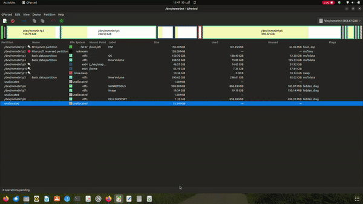
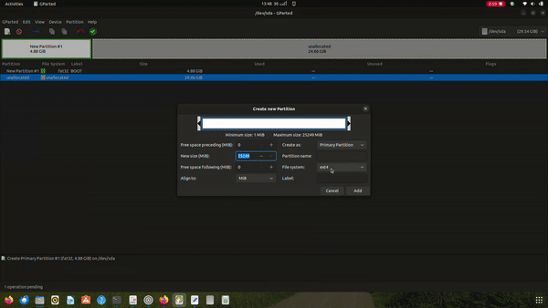
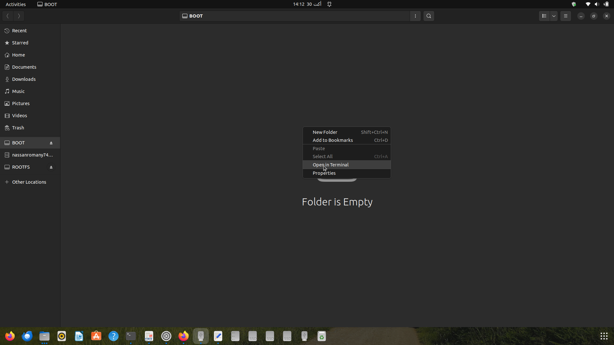
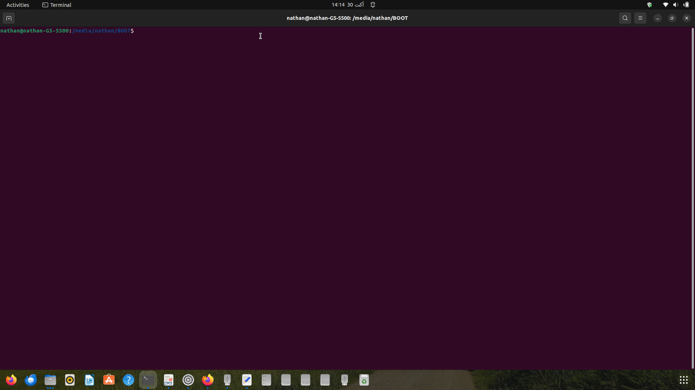
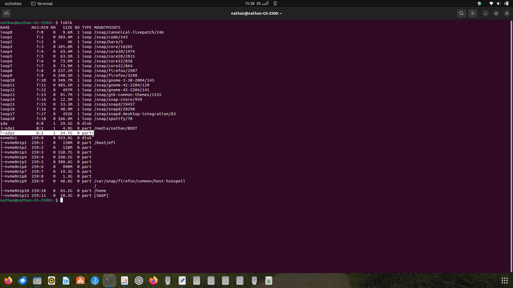
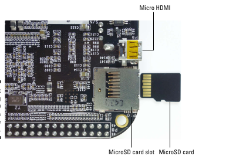
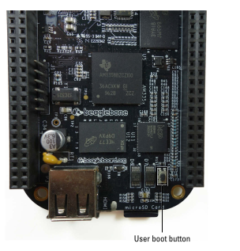

## BeagleBone Black Ubuntu 22.04 BOOT

This repository contains instructions and scripts for setting up a BeagleBone Black (rev C) with Ubuntu 22.04. Follow these steps to get your BeagleBone Black up and running with the latest version of Ubuntu.

### Prerequisites

Before you begin, ensure you have the following:

- A BeagleBone Black (rev C) board
- A computer with an SD card reader
- A microSD card (16GB or higher)
- A stable internet connection
- A mini-USB cable which is included with BeagleBone box
- A Ethernet cable

### Preparing SD card

1. Download gparted APP from ubuntu software

2. open it and do as the following : 





by ending the previous steps your SD card would be ready to esstablishing booting files

3. Now PC would read the new partitions of cd card, so open BOOT partition and open terminal






then download the following MLO & u-boot.img using those bash script

```bash
wget https://angstrom.s3.amazonaws.com/demo/beaglebone/MLO #MLO

wget https://angstrom.s3.amazonaws.com/demo/beaglebone/u-boot.img #u-boot.img

```

4. Open new terminal and download latest Ubuntu 22.04 verision

```bash

#Take look at rcn-ee.com for any updates and new versions
wget https://rcn-ee.com/rootfs/ubuntu-armhf-22.04-console-v5.10-ti/2023-10-26/am335x-ubuntu-22.04.3-console-armhf-2023-10-26-4gb.img.xz

```

5. Decompress the Ubuntu 22.04 image

```bash
xz -d am335x-ubuntu-22.04.3-console-armhf-2023-10-26-4gb.img.xz

```

6. Flashing a microSd card 

```bash
#This command is for finding ROOTFS path
lsblk 

```


note it may be different at your pc so check it.
Now, we can flash our SD card

```bash
sudo dd if=~/Downloads/am335x-ubuntu-22.04.3-console-armhf-2023-10-26-4gb.img of=/dev/sda2 bs=1M

```
# Note: Flashing would take several minitues, so be patient please.
now, You can take off Sd card

7. Connect BeagleBone with Ethernet cable to your router and the mini-USB to PC,
then put the following bash at terminal.

```bash
sudo ssh debian@beaglebone.local

```
Login to BeagleBone with the temporary (username:password) (debian:temppwd)

```bash
ping google.com

```
- While your BeagleBone Black is powered off, insert your microSD card into the microSD slot (refer to Figure 2-6).

- Hold down the user boot button of the BeagleBone (refer to Figure 2-7).

- While holding the user boot button, press the power button on your board. When the board is powered up, you should continue to hold the user boot button for 5 to 7 seconds and then release it.The USR LEDs blink during this process.Flashing can take about 30 to 40 minutes. When this process is finished, all four USR LEDs will be off.

- Unplug your board.






